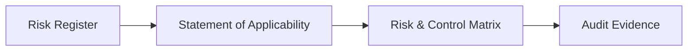

# Statement of Applicability (SoA)

## ISO/IEC 27001:2022

---

## 1. Document Control

| Field            | Value                                                              |
| ---------------- | ------------------------------------------------------------------ |
| Organization     | MedTech Solutions Ltd                                              |
| ISMS Scope       | Development, hosting, and support of healthcare software platforms |
| Standard         | ISO/IEC 27001:2022                                                 |
| Prepared By      | Information Security Audit Team                                    |
| Approved By      | ISMS Owner                                                         |
| Version          | 1.0                                                                |
| Last Review Date | 2026-02-07                                                         |

---

## 2. Purpose of the Statement of Applicability

This Statement of Applicability (SoA) identifies all ISO/IEC 27001:2022 Annex A controls that are applicable to the Information Security Management System (ISMS) of MedTech Solutions Ltd.

For each control, the SoA:

* States whether the control is **applicable or not applicable**
* Provides a **justification** for inclusion or exclusion
* Indicates the **implementation status**
* Links the control to relevant **RCM Risk IDs**

This document fulfills the requirements of **ISO/IEC 27001:2022 Clause 6.1.3 d)**.

---

## 3. Applicability Criteria

Controls are considered **Not Applicable** only when:

* The risk does not exist within the ISMS scope
* The organization has no processes, assets, or activities related to the control
* Exclusion does not introduce unacceptable risk

All exclusions are justified and approved by ISMS management.

---

## 4. Statement of Applicability – Annex A Controls

### 4.1 Organizational Controls (A.5)

| Annex A ID | Control Name                              | Applicable | Justification                                       | Linked RCM Risk ID | Implementation Status |
| ---------- | ----------------------------------------- | ---------- | --------------------------------------------------- | ------------------ | --------------------- |
| A.5.1      | Policies for information security         | Yes        | Required to define ISMS governance                  | R-GOV-01           | Implemented           |
| A.5.7      | Threat intelligence                       | Yes        | Organization monitors cybersecurity threats         | R-TH-01            | Implemented           |
| A.5.9      | Inventory of information and other assets | Yes        | Information assets must be identified and protected | R-AM-01            | Implemented           |
| A.5.15     | Access control                            | Yes        | Prevents unauthorized system access                 | R-AC-01            | Implemented           |
| A.5.18     | Access rights                             | Yes        | Ensures least privilege                             | R-AC-02            | Partially Implemented |

---

### 4.2 People Controls (A.6)

| Annex A ID | Control Name                   | Applicable | Justification                              | Linked RCM Risk ID | Implementation Status |
| ---------- | ------------------------------ | ---------- | ------------------------------------------ | ------------------ | --------------------- |
| A.6.1      | Screening                      | Yes        | Employees handle sensitive healthcare data | R-HR-01            | Implemented           |
| A.6.3      | Information security awareness | Yes        | Reduces human-related security incidents   | R-HR-02            | Implemented           |
| A.6.4      | Disciplinary process           | Yes        | Required to enforce ISMS policies          | R-HR-03            | Implemented           |

---

### 4.3 Physical Controls (A.7)

| Annex A ID | Control Name                    | Applicable | Justification                                               | Linked RCM Risk ID | Implementation Status |
| ---------- | ------------------------------- | ---------- | ----------------------------------------------------------- | ------------------ | --------------------- |
| A.7.1      | Physical security perimeters    | No         | Organization operates fully remote with no owned facilities | N/A                | Not Applicable        |
| A.7.4      | Physical security monitoring    | No         | No physical offices or on‑prem data centers                 | N/A                | Not Applicable        |
| A.7.9      | Security of assets off‑premises | Yes        | Company laptops are used remotely                           | R-PH-01            | Implemented           |

---

### 4.4 Technological Controls (A.8)

| Annex A ID | Control Name             | Applicable | Justification                           | Linked RCM Risk ID | Implementation Status |
| ---------- | ------------------------ | ---------- | --------------------------------------- | ------------------ | --------------------- |
| A.8.5      | Secure authentication    | Yes        | MFA required for cloud systems          | R-ID-01            | Implemented           |
| A.8.9      | Configuration management | Yes        | Prevents insecure system configurations | R-CM-01            | Implemented           |
| A.8.13     | Information backup       | Yes        | Ensures availability of healthcare data | R-BA-01            | Implemented           |
| A.8.15     | Logging                  | Yes        | Enables detection of security incidents | R-LM-01            | Implemented           |

---

## 5. Control Exclusion Summary

All controls marked **Not Applicable** have been reviewed and approved by ISMS management. Their exclusion does not introduce unacceptable information security risk.

---

## 6. Audit Traceability

The following diagram illustrates traceability between risks, the SoA, the RCM, and audit evidence.

---

## 7. Approval

| Role         | Name | Signature | Date |
| ------------ | ---- | --------- | ---- |
| ISMS Owner   |      |           |      |
| Lead Auditor |      |           |      |

