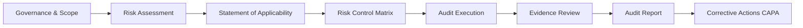
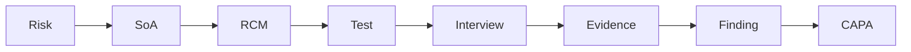
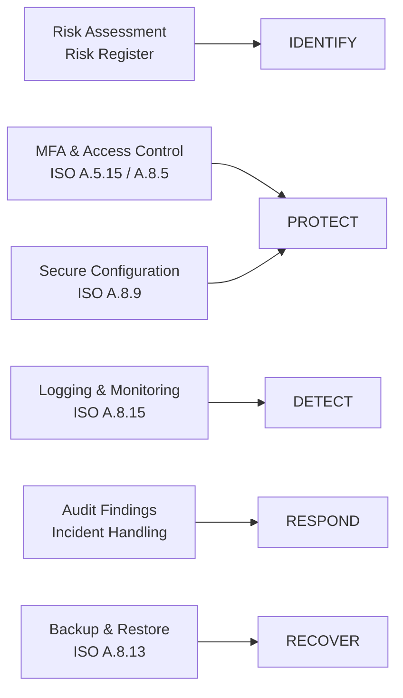

##  🛡️ Information Security Audit Playbook – ISO/IEC 27001:2022

A practical, audit-ready **Information Security Audit Playbook** aligned with **ISO/IEC 27001:2022**, designed to demonstrate how an organization can plan, execute, and document an internal information security audit with full traceability from **risk → control → evidence → improvement**.

This repository is built as a **realistic ISMS case study**, not just theory.**Note:** All examples are fictional/sanitized for use.

---


## Contents 
- Audit planning + scope pack
- Risk assessment methodology (inherent/residual)
- Framework mapping (ISO 27001 / NIST CSF / CIS)
- Control test programs (access, network, logging, vuln mgmt, cloud governance)
- Evidence checklists + sample evidence requests
- Findings, risk rating, executive summary, management response workflow


---

## 🎯 Project Objectives

This project demonstrates how to:

- Apply a **risk-based approach** to information security audits
- Map risks to **ISO 27001 Annex A controls**
- Build a **Risk Control Matrix (RCM)** with audit tests
- Collect and organize **objective evidence**
- Validate controls through **interviews**
- Perform an **internal audit** and document findings
- Manage **corrective actions (CAPA)**

It is suitable for:
- ISO 27001 learners
- Junior auditors / GRC analysts
- Cybersecurity students
- ISMS practitioners preparing for audits

---

## 🧭 High-Level Audit Flow


## Folder Explanation
---
01_Governance_And_Context
---

Defines the ISMS foundation:

ISMS scope

Security policies

Roles & responsibilities

➡️ Aligns with ISO 27001 Clauses 4 & 5

⚠️ 02_Risk_Management
---
Implements the risk-based approach:

Risk assessment methodology

Risk register

Risk treatment logic

➡️ Aligns with ISO 27001 Clause 6

🧩 03_Control_Framework_Mapping
---
Core compliance mapping:

Statement of Applicability (SoA)

Risk Control Matrix (RCM)

Mapping to Annex A controls

Each RCM entry includes:

Risk

Control

Test procedure

Interview reference

Evidence reference

➡️ Aligns with ISO 27001 Annex A

 04_Audit_Execution
---
Shows how the audit is performed:

Audit plan & checklists

Control testing procedures

Interview records with control owners

Interviews validate that controls are actually followed, not just documented.

➡️ Aligns with ISO 27001 Clause 9.2

📁 05_Evidence_Repository
---
Contains objective audit evidence, including:

Cloud security screenshots

MFA enforcement

Access reviews

Logging dashboards

Backup & restore tests

Evidence is referenced directly from the RCM and interviews.

➡️ Supports audit traceability

🧪 11_case_study
---
A complete end-to-end internal audit case study:

Internal audit execution

Audit report with findings

Corrective Action Plan (CAPA)

Demonstrates:

Nonconformity handling

Root cause analysis

Corrective & preventive actions

➡️ Aligns with ISO 27001 Clauses 9 & 10


this project enforces full traceability:





## Key Concepts Explained Simply
---
RCM (Risk Control Matrix)
Links risks to controls and explains how auditors test them.

SoA (Statement of Applicability)
Explains which Annex A controls apply and why.

Interview Evidence
Confirms that people understand and follow the controls.

CAPA
Documents how issues are fixed and prevented from happening again.


## Mapping YOUR RCM controls → NIST CSF functions

Based on what you already have in your RCM:
| RCM Area             | Example Control (ISO 27001)         | What it does                | NIST Function |
| -------------------- | ----------------------------------- | --------------------------- | ------------- |
| Risk Assessment      | Risk register, scope definition     | Identify assets & risks     | **Identify**  |
| IAM / MFA            | A.5.15, A.8.5 – MFA, access control | Prevent unauthorized access | **Protect**   |
| Secure Configuration | A.8.9 – baseline configurations     | Reduce attack surface       | **Protect**   |
| Logging & Monitoring | A.8.15 – centralized logging        | Detect suspicious activity  | **Detect**    |
| Incident Handling    | Audit findings & escalation         | Manage incidents            | **Respond**   |
| Backup & Recovery    | A.8.13 – backup & restore testing   | Restore operations          | **Recover**   |


## 🔗 RCM to NIST CSF Mapping

The Risk Control Matrix (RCM) in this project is aligned with the
NIST Cybersecurity Framework to ensure full coverage of cybersecurity
risk areas.




---

# RCM → Evidence → CAPA Diagram (Very Important)


### Mermaid diagram

```markdown
## 🔄 Audit Traceability: RCM → Evidence → CAPA

This project enforces full audit traceability from risk identification
to corrective action.

```mermaid
flowchart LR
    RISK[Risk Identified] --> RCM[Risk Control Matrix]
    RCM --> TEST[Control Testing]
    TEST --> INT[Interviews]
    TEST --> EVID[Evidence Review]
    EVID --> FIND[Audit Finding]
    FIND --> CAPA[Corrective Action Plan]

## 🧭 How to Navigate This Repository

This repository follows the logical flow of an ISO 27001 internal audit.

```mermaid
flowchart TB
    GOV[01 Governance & Context] --> RISK[02 Risk Management]
    RISK --> MAP[03 Control Framework Mapping]
    MAP --> AUD[04 Audit Execution]
    AUD --> EVID[05 Evidence Repository]
    EVID --> CASE[11 Case Study & CAPA]


