# 🛡️ Information Security & IT Risk Audit Playbook  
**ISO/IEC 27001:2022 | NIST CSF | CIS Controls**

A consulting-grade **information security audit playbook** demonstrating an end-to-end, risk-based **ISO/IEC 27001:2022 internal audit**, enhanced with **NIST Cybersecurity Framework** risk coverage and **CIS Critical Security Controls** technical benchmarking.

This repository is built as a **realistic audit case study**, not a theoretical framework summary.

---

## 📌 About the Playbook

This project simulates how a multinational organization designs, executes, and documents an **information security and IT risk audit**, following **real audit methodology** used by consultants and internal audit teams.

All examples, evidence, and organizations are **fictional or sanitized** and intended for **educational and portfolio demonstration purposes**.

---

## 🎯 Objectives

This playbook demonstrates how to:

- Apply a **risk-based audit approach**
- Perform an **ISO 27001 internal audit**
- Build a **Risk Control Matrix (RCM)**
- Define a **Statement of Applicability (SoA)**
- Conduct **control testing, interviews, and evidence review**
- Produce **audit findings and executive summaries**
- Manage **nonconformities and corrective actions (CAPA)**
- Ensure **full audit traceability**

---

## 🧭 High-Level ISO 27001 Audit Flow

```mermaid
flowchart LR
    A[Governance & Scope] --> B[Risk Assessment]
    B --> C[Statement of Applicability]
    C --> D[Risk Control Matrix]
    D --> E[Audit Execution]
    E --> F[Evidence Review]
    F --> G[Audit Report]
    G --> H[Corrective Action Plan]
 All examples are fictional/sanitized for use.

---
## Repository Structure
information-security-audit-playbook-v4/
├── 01_Governance_And_Context
├── 02_Risk_Management
├── 03_Control_Framework_Mapping
├── 04_Audit_Execution
├── 05_Evidence_Repository
└── 11_case_study


##  Folder Overview
🏛️ 01_Governance_And_Context

Defines the ISMS foundation:

ISMS scope

Security policies

Roles and responsibilities
ISO 27001 Clauses: 4, 5

02_Risk_Management

Implements the risk assessment process:

Risk methodology

Risk register

Risk treatment logic
ISO 27001 Clause: 6

🧩 03_Control_Framework_Mapping

Core compliance and assurance artifacts:

Statement of Applicability (SoA)

Risk Control Matrix (RCM)

ISO 27001 ↔ NIST CSF mapping

ISO 27001 ↔ CIS Controls mapping

This folder is the heart of the audit design.

04_Audit_Execution

Shows how the audit is performed:

Audit plans and checklists

Control testing procedures

Interview records with control owners
ISO 27001 Clause: 9.2

05_Evidence_Repository

Contains objective audit evidence:

IAM and MFA screenshots

Access review records

Logging dashboards

Backup and restore tests

Evidence is directly referenced in the RCM and interviews.

11_case_study

A complete internal audit case study:

Internal audit report

Audit findings

Corrective Action Plan (CAPA)

Root cause analysis
ISO 27001 Clauses: 9, 10

Key Audit Artifacts

| Artifact      | Purpose                         |
| ------------- | ------------------------------- |
| Risk Register | Identify and assess risks       |
| SoA           | Justify control applicability   |
| RCM           | Link risk → control → test      |
| Interviews    | Validate real implementation    |
| Evidence      | Objective proof                 |
| Audit Report  | Findings & conclusions          |
| CAPA          | Corrective & preventive actions |


Use of Security Frameworks

This project uses multiple frameworks in a complementary way:

ISO/IEC 27001:2022
Primary framework used to design and audit the Information Security
Management System (ISMS), including governance, risk management,
control selection, and continual improvement.

NIST Cybersecurity Framework (CSF)
Used as a risk coverage model to ensure that audit controls address
all key cybersecurity functions: Identify, Protect, Detect, Respond,
and Recover.

CIS Critical Security Controls
Used as technical implementation benchmarks to validate that
security controls follow industry best practices.

ISO 27001 serves as the backbone, while NIST CSF and CIS Controls enhance
governance clarity and technical assurance.

RCM Controls Mapped to NIST CSF

```mermaid
flowchart LR
    R[Risk Assessment<br/>Risk Register] --> I[IDENTIFY]

    IAM[MFA & Access Control<br/>ISO A.5.15 / A.8.5] --> P[PROTECT]
    CONF[Secure Configuration<br/>ISO A.8.9] --> P

    LOG[Logging & Monitoring<br/>ISO A.8.15] --> D[DETECT]

    IR[Audit Findings<br/>Incident Handling] --> RS[RESPOND]

    BCK[Backup & Restore<br/>ISO A.8.13] --> RC[RECOVER]
```

CIS Controls Alignment

```mermaid
flowchart LR
    IAM[Access Control & MFA] --> CIS6[CIS 6 – Access Control Management]
    LOG[Logging & Monitoring] --> CIS8[CIS 8 – Audit Log Management]
    BCK[Backup & Restore] --> CIS11[CIS 11 – Data Recovery]
    CONF[Secure Configuration] --> CIS4[CIS 4 – Secure Configuration]
```



Audit Traceability: RCM → Evidence → CAPA

How to Navigate This Repository

Summary

“This project demonstrates a full ISO 27001 internal audit lifecycle, including risk assessment, control mapping, audit execution, interviews, evidence review, and corrective actions, with cross-framework alignment to NIST CSF and CIS Controls.

